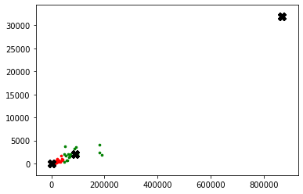
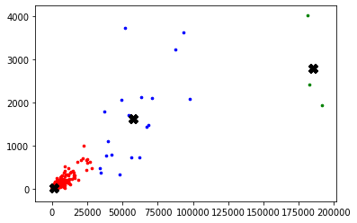

# Tarefa 1: Aprendizado Não-Supervisionado

**Autor**: Matheus Jericó Palhares <br>
**LinkedIn**: https://linkedin.com/in/matheusjerico <br>
**Github**: https://github.com/matheusjerico

### 1) Implementar a função “fit_k_means(pontos, parada, max_iter)”, com K fixo e igual a 3. Retorne os centróides finais.

**Variáveis**:
- pontos: conjunto de pontos 2D (casos x mortes) que serão clusterizados
- parada: valor da variação dos clusters que indicará o fim do treinamento, i.e., se distancia(centroide_antigo, centroide_novo) < parada então termine o treinamento
- max_iter: quantidade máxima de vezes que o algoritmo deve ser repetido caso “parada” não seja alcançada


O relatório será o notebook exportado para um arquivo HTML e deve conter:
- Um scatter plot mostrando os centróides (com marcador x) e seus respectivos pontos (cada cluster deve estar em uma cor distinta)
- Para cada cluster, também devem ser exibidas as distâncias médias entre os pontos e seu respectivo centróide final
- Discorra sobre cada cluster: o que eles indicam?


#### 1. Bibliotecas


```python
import numpy as np
import matplotlib.pyplot as plt
import pandas as pd
import random as rd
from copy import deepcopy
```

#### 2. Carregando dados


```python
dataset = pd.read_csv("Dataset/base-covid-19-us.csv")
dataset.head()
```


<div>
<table border="1" class="dataframe">
  <thead>
    <tr style="text-align: right;">
      <th></th>
      <th>county</th>
      <th>cases</th>
      <th>deaths</th>
    </tr>
  </thead>
  <tbody>
    <tr>
      <th>0</th>
      <td>Abbeville</td>
      <td>84</td>
      <td>0</td>
    </tr>
    <tr>
      <th>1</th>
      <td>Acadia</td>
      <td>741</td>
      <td>21</td>
    </tr>
    <tr>
      <th>2</th>
      <td>Accomack</td>
      <td>116</td>
      <td>0</td>
    </tr>
    <tr>
      <th>3</th>
      <td>Ada</td>
      <td>4264</td>
      <td>41</td>
    </tr>
    <tr>
      <th>4</th>
      <td>Adair</td>
      <td>325</td>
      <td>8</td>
    </tr>
  </tbody>
</table>
</div>


```python
dataset.shape
```


    (1570, 3)


```python
dataset.sort_values(by=['deaths'], inplace=True)
```


```python
cases = dataset['cases'].values
deaths = dataset['deaths'].values
X = np.array(list(zip(cases, deaths)))
plt.scatter(cases, deaths, c='black', s=10)
```


    <matplotlib.collections.PathCollection at 0x7fe37a035898>


#### 3. Criando classe do KMeans


```python
class K_Means:
    def __init__(self, pontos, parada = 0.00000001, max_iter = 100):
        self.k = 3
        self.parada = parada
        self.max_iter = max_iter
        self.data = pontos

    # Calculando distância euclidiana
    def dist(self, a, b, ax=1):
        return np.linalg.norm(a - b, axis=ax)

    def fit(self):
        # coordenada X centroide
        centroids_x = np.random.randint(0, np.median(self.data), size=self.k)
        # coordenada Y centroide
        centroids_y = np.random.randint(0, np.median(self.data), size=self.k)
        self.centroids = np.array(list(zip(centroids_x, centroids_y)), dtype=np.float32)
        
        # armazenando o valor dos centroides quando ele for atualizado
        self.centroids_old = np.zeros(self.centroids.shape)
        
        # label dos clusters 
        self.clusters = np.zeros(len(self.data))
        # distancia entre centroide novo e centroide antigo
        error = self.dist(self.centroids, self.centroids_old, None)
        # Loop de treinamento
        for i in range(self.max_iter):
            # atribuindo cada valor ao cluster mais próximo
            for i in range(len(self.data)):
                distances = self.dist(self.data[i], self.centroids)
                self.cluster = np.argmin(distances)
                self.clusters[i] = self.cluster
            # guardando valores do centroide antigo
            self.centroids_old = deepcopy(self.centroids)
            # encontrando novo centroide
            for i in range(self.k):
                self.points = [self.data[j] for j in range(len(self.data)) if self.clusters[j] == i]
                self.centroids[i] = np.mean(self.points, axis=0)
            error = self.dist(self.centroids, self.centroids_old, None)
            if error <= self.parada:
                break
```

#### 4. Inicializando a classe com os parametros desejados do exercício e realizando o treinamento


```python
kmeans = K_Means(pontos = X, parada = 0.0001, max_iter = 100)
kmeans.fit()
```


```python
kmeans.centroids
```


    array([[1.1869150e+03, 2.8396652e+01],
           [8.8945375e+04, 2.1148750e+03],
           [8.6882400e+05, 3.1887000e+04]], dtype=float32)


```python
dataset['cluster'] = kmeans.clusters
```


```python
dataset.info()
```

    <class 'pandas.core.frame.DataFrame'>
    Int64Index: 1570 entries, 0 to 995
    Data columns (total 4 columns):
     #   Column   Non-Null Count  Dtype  
    ---  ------   --------------  -----  
     0   county   1570 non-null   object 
     1   cases    1570 non-null   int64  
     2   deaths   1570 non-null   int64  
     3   cluster  1570 non-null   float64
    dtypes: float64(1), int64(2), object(1)
    memory usage: 61.3+ KB


```python
dataset.head()
```


<div>
<table border="1" class="dataframe">
  <thead>
    <tr style="text-align: right;">
      <th></th>
      <th>county</th>
      <th>cases</th>
      <th>deaths</th>
      <th>cluster</th>
    </tr>
  </thead>
  <tbody>
    <tr>
      <th>0</th>
      <td>Abbeville</td>
      <td>84</td>
      <td>0</td>
      <td>0.0</td>
    </tr>
    <tr>
      <th>865</th>
      <td>Manitowoc</td>
      <td>17</td>
      <td>0</td>
      <td>0.0</td>
    </tr>
    <tr>
      <th>866</th>
      <td>Marathon</td>
      <td>108</td>
      <td>0</td>
      <td>0.0</td>
    </tr>
    <tr>
      <th>869</th>
      <td>Maries</td>
      <td>20</td>
      <td>0</td>
      <td>0.0</td>
    </tr>
    <tr>
      <th>871</th>
      <td>Marinette</td>
      <td>27</td>
      <td>0</td>
      <td>0.0</td>
    </tr>
  </tbody>
</table>
</div>


#### 5. Visualizando graficamente


```python
colors = ['r', 'g', 'b', 'y', 'c', 'm']
fig, ax = plt.subplots()
for i in range(kmeans.k):
        points = np.array([X[j] for j in range(len(X)) if kmeans.clusters[j] == i])
        ax.scatter(points[:, 0], points[:, 1], s=7, c=colors[i])
        ax.scatter(kmeans.centroids[:, 0], kmeans.centroids[:, 1], marker='X', s=100, c='black')
```





```python
kmeans.centroids
```


    array([[1.1869150e+03, 2.8396652e+01],
           [8.8945375e+04, 2.1148750e+03],
           [8.6882400e+05, 3.1887000e+04]], dtype=float32)


**Resposta**: <br>
Os clusters representam os estados com base na quantidade de casos e mortes do COVID-19.
- O primeiro cluster (verde), representa os estados que tiveram baixa quantidade de casos e mortes devido ao COVID-19
- O segundo cluster(azul), representa os estados que tiveram quantidade moderada/alta de casos e mortes devido ao COVID-19.
- O terceiro cluster (vermelho), representa o estado de New York (possuem uma quantidade muito elevada de casos de COVID-19


#### 6. Para cada cluster, também devem ser exibidas as distâncias médias entre os pontos e seu respectivo centróide final


```python
dataset['centroide_x'] = np.nan
dataset['centroide_y'] = np.nan
```


```python
dataset.loc[dataset['cluster'] == 0.0, 'centroide_x'] = kmeans.centroids[0][0]
dataset.loc[dataset['cluster'] == 0.0, 'centroide_y'] = kmeans.centroids[0][1]
dataset.loc[dataset['cluster'] == 1.0, 'centroide_x'] = kmeans.centroids[1][0]
dataset.loc[dataset['cluster'] == 1.0, 'centroide_y'] = kmeans.centroids[1][1]
dataset.loc[dataset['cluster'] == 2.0, 'centroide_x'] = kmeans.centroids[2][0]
dataset.loc[dataset['cluster'] == 2.0, 'centroide_y'] = kmeans.centroids[2][1]
```


```python
dataset['distancia_x'] = np.abs(dataset['cases'] - dataset['centroide_x'])
dataset['distancia_y'] = np.abs(dataset['deaths'] - dataset['centroide_y'])
```


```python
print("Distância média (eixo X) entre os pontos do centroide 0.0: {}".format(np.mean(dataset[dataset['cluster']==0.0]['distancia_x'])))
print("Distância média (eixo Y) entre os pontos do centroide 0.0: {}".format(np.mean(dataset[dataset['cluster']==0.0]['distancia_y'])))
print("Distância média (eixo X) entre os pontos do centroide 1.0: {}".format(np.mean(dataset[dataset['cluster']==1.0]['distancia_x'])))
print("Distância média (eixo Y) entre os pontos do centroide 1.0: {}".format(np.mean(dataset[dataset['cluster']==1.0]['distancia_y'])))
print("Distância média (eixo X) entre os pontos do centroide 2.0: {}".format(np.mean(dataset[dataset['cluster']==2.0]['distancia_x'])))
print("Distância média (eixo Y) entre os pontos do centroide 2.0: {}".format(np.mean(dataset[dataset['cluster']==2.0]['distancia_y'])))
```

    Distância média (eixo X) entre os pontos do centroide 0.0: 1638.429133506721
    Distância média (eixo Y) entre os pontos do centroide 0.0: 40.70434138979055
    Distância média (eixo X) entre os pontos do centroide 1.0: 37588.515625
    Distância média (eixo Y) entre os pontos do centroide 1.0: 813.609375
    Distância média (eixo X) entre os pontos do centroide 2.0: 0.0
    Distância média (eixo Y) entre os pontos do centroide 2.0: 0.0


### **Obs**: Retirando o estado de New York, a visualização do cluster fica muito melhor.

#### 7. Retirando o estado de New York
- Retirar o estado de New York, utilizar o algoritmo Kmeans e visualizar os cluster.


```python
dataset=dataset.iloc[:-1,:]
```


```python
cases = dataset['cases'].values
deaths = dataset['deaths'].values
X = np.array(list(zip(cases, deaths)))
plt.scatter(cases, deaths, c='black', s=10)
```


    <matplotlib.collections.PathCollection at 0x7fe379eeb518>


```python
kmeans = K_Means(pontos = X, parada = 0.0001, max_iter = 100)
kmeans.fit()
```


```python
colors = ['r', 'g', 'b', 'y', 'c', 'm']
fig, ax = plt.subplots()
for i in range(kmeans.k):
        points = np.array([X[j] for j in range(len(X)) if kmeans.clusters[j] == i])
        ax.scatter(points[:, 0], points[:, 1], s=7, c=colors[i])
        ax.scatter(kmeans.centroids[:, 0], kmeans.centroids[:, 1], marker='X', s=100, c='black')
```





```python
kmeans.centroids
```


    array([[1.8495167e+05, 2.7943333e+03],
           [1.0462534e+03, 2.5062702e+01],
           [5.7526105e+04, 1.6201578e+03]], dtype=float32)


```python
dataset['cluster'] = kmeans.clusters
```


```python
dataset['centroide_x'] = np.nan
dataset['centroide_y'] = np.nan
```


```python
dataset.loc[dataset['cluster'] == 0.0, 'centroide_x'] = kmeans.centroids[0][0]
dataset.loc[dataset['cluster'] == 0.0, 'centroide_y'] = kmeans.centroids[0][1]
dataset.loc[dataset['cluster'] == 1.0, 'centroide_x'] = kmeans.centroids[1][0]
dataset.loc[dataset['cluster'] == 1.0, 'centroide_y'] = kmeans.centroids[1][1]
dataset.loc[dataset['cluster'] == 2.0, 'centroide_x'] = kmeans.centroids[2][0]
dataset.loc[dataset['cluster'] == 2.0, 'centroide_y'] = kmeans.centroids[2][1]
```


```python
dataset['distancia_x'] = np.abs(dataset['cases'] - dataset['centroide_x'])
dataset['distancia_y'] = np.abs(dataset['deaths'] - dataset['centroide_y'])
```


```python
print("Distância média (eixo X) entre os pontos do centroide 0.0: {}".format(np.mean(dataset[dataset['cluster']==0.0]['distancia_x'])))
print("Distância média (eixo Y) entre os pontos do centroide 0.0: {}".format(np.mean(dataset[dataset['cluster']==0.0]['distancia_y'])))
print("Distância média (eixo X) entre os pontos do centroide 1.0: {}".format(np.mean(dataset[dataset['cluster']==1.0]['distancia_x'])))
print("Distância média (eixo Y) entre os pontos do centroide 1.0: {}".format(np.mean(dataset[dataset['cluster']==1.0]['distancia_y'])))
print("Distância média (eixo X) entre os pontos do centroide 2.0: {}".format(np.mean(dataset[dataset['cluster']==2.0]['distancia_x'])))
print("Distância média (eixo Y) entre os pontos do centroide 2.0: {}".format(np.mean(dataset[dataset['cluster']==2.0]['distancia_y'])))
```

    Distância média (eixo X) entre os pontos do centroide 0.0: 4149.557291666667
    Distância média (eixo Y) entre os pontos do centroide 0.0: 821.111083984375
    Distância média (eixo X) entre os pontos do centroide 1.0: 1413.854592873808
    Distância média (eixo Y) entre os pontos do centroide 1.0: 35.405063352973215
    Distância média (eixo X) entre os pontos do centroide 2.0: 15709.806126644737
    Distância média (eixo Y) entre os pontos do centroide 2.0: 834.6925177323191

